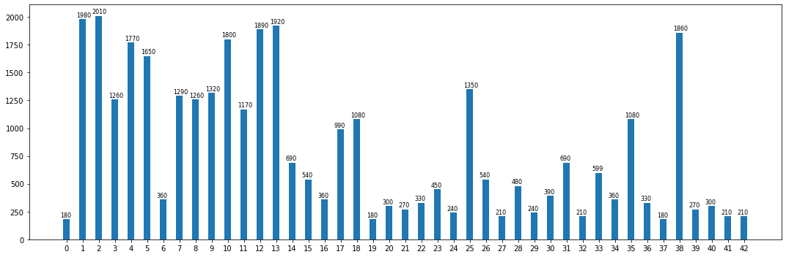
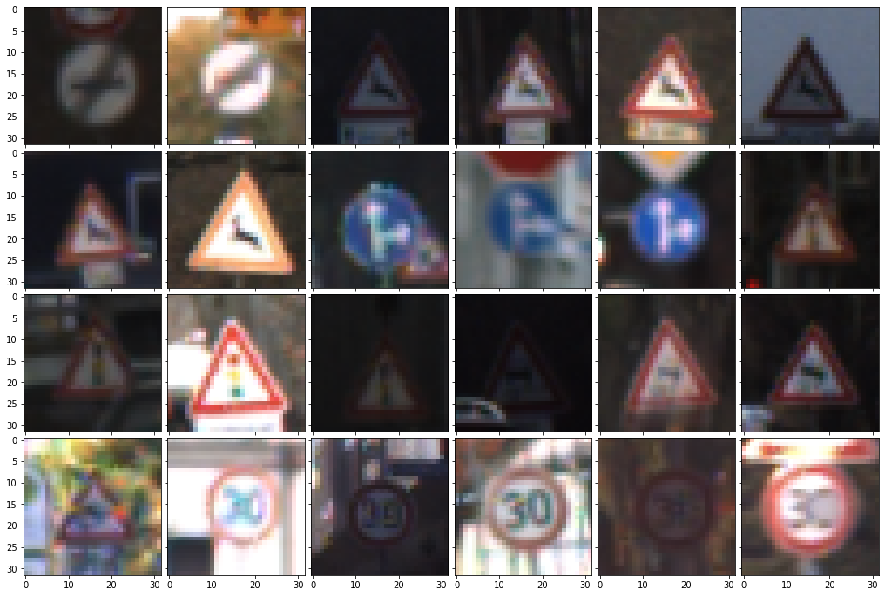
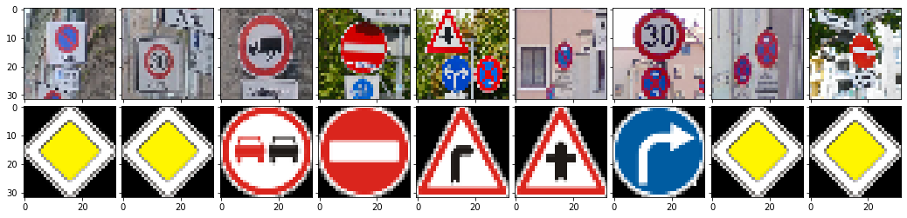
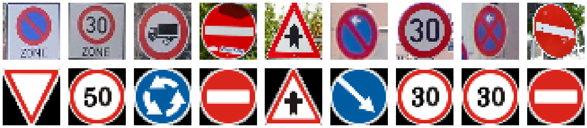
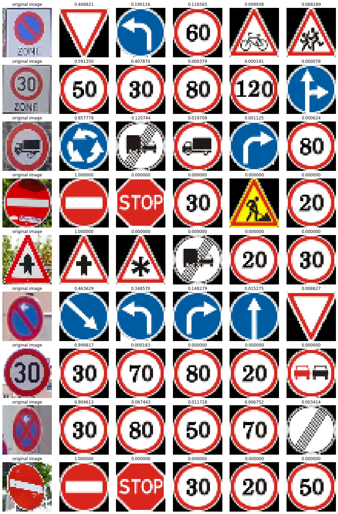
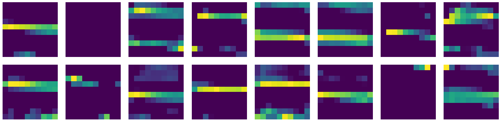
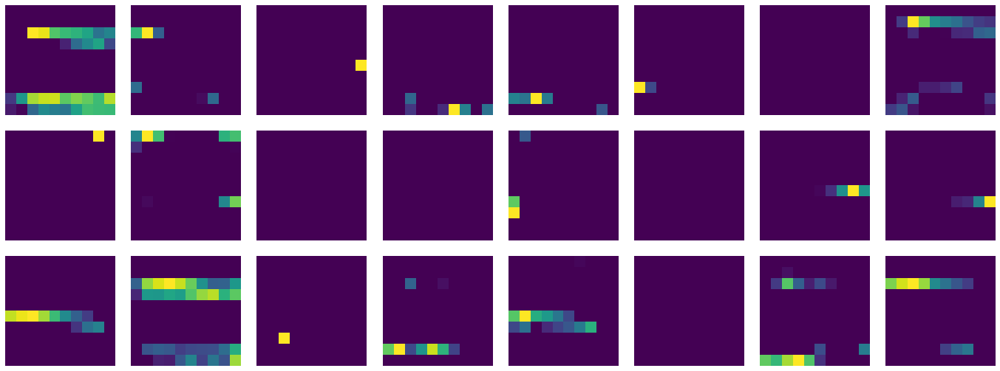

# **Traffic Sign Recognition** 

## Writeup

### You can use this file as a template for your writeup if you want to submit it as a markdown file, but feel free to use some other method and submit a pdf if you prefer.

---

**Build a Traffic Sign Recognition Project**

The goals / steps of this project are the following:
* Load the data set (see below for links to the project data set)
* Explore, summarize and visualize the data set
* Design, train and test a model architecture
* Use the model to make predictions on new images
* Analyze the softmax probabilities of the new images
* Summarize the results with a written report

[//]: # (Image References)

[image1]: ./examples/visualization.jpg "Visualization"
[image2]: ./examples/grayscale.jpg "Grayscaling"
[image3]: ./examples/random_noise.jpg "Random Noise"
[image4]: ./examples/placeholder.png "Traffic Sign 1"
[image5]: ./examples/placeholder.png "Traffic Sign 2"
[image6]: ./examples/placeholder.png "Traffic Sign 3"
[image7]: ./examples/placeholder.png "Traffic Sign 4"
[image8]: ./examples/placeholder.png "Traffic Sign 5"

## Rubric Points
### Here I will consider the [rubric points](https://review.udacity.com/#!/rubrics/481/view) individually and describe how I addressed each point in my implementation.  

---
### Writeup / README

#### 1. Provide a Writeup / README that includes all the rubric points and how you addressed each one. You can submit your writeup as markdown or pdf. You can use this template as a guide for writing the report. The submission includes the project code.

You're reading it! and here is a link to my [project code](https://github.com/huiba/CarND-Traffic-Sign-Classifier-Project/blob/master/Traffic_Sign_Classifier.ipynb)

I used goolge colab as my development environment. And the datasets are loaded from google drive.
### Data Set Summary & Exploration

#### 1. Provide a basic summary of the data set. In the code, the analysis should be done using python, numpy and/or pandas methods rather than hardcoding results manually.

I used the numpy library to calculate summary statistics of the traffic
signs data set:
* The size of training set is 34799 
* The size of the validation set is 4410
* The size of test set is 12630
* The shape of a traffic sign image is (32, 32, 3)
* The number of unique classes/labels in the data set is 43

#### 2. Include an exploratory visualization of the dataset.

Here is an exploratory visualization of the data set. It is a bar chart showing the distribution of each label

### Design and Test a Model Architecture

#### 1. Describe how you preprocessed the image data. What techniques were chosen and why did you choose these techniques? Consider including images showing the output of each preprocessing technique. Pre-processing refers to techniques such as converting to grayscale, normalization, etc. (OPTIONAL: As described in the "Stand Out Suggestions" part of the rubric, if you generated additional data for training, describe why you decided to generate additional data, how you generated the data, and provide example images of the additional data. Then describe the characteristics of the augmented training set like number of images in the set, number of images for each class, etc.)

I just use the color images, and normalized them by `(pixel - 128)/ 128`. Moreover, I augmented the training dataset by randomly flipping images. 

Here are some example images

#### 2. Describe what your final model architecture looks like including model type, layers, layer sizes, connectivity, etc.) Consider including a diagram and/or table describing the final model.

My final model consisted of the following layers:

| Layer         		|     Description	        					| 
|:---------------------:|:---------------------------------------------:| 
| Input         		| 32x32x3 RGB image   							| 
| Convolution 5x5     	| 1x1 stride, valid padding, outputs 28x28x6 	|
| RELU					|												|
| Max pooling	      	| 2x2 stride,  outputs 14x14x6 				|
| Convolution 5x5	    | 1x1 stride, valid padding, outputs 10x10x16  	|
| RELU					|												|
| Convolution 5x5	    | 1x1 stride, same padding, outputs 10x10x24  	|
| RELU					|												|
| Max pooling	      	| 2x2 stride,  outputs 14x14x6 				|
| Fully connected		| outputs 120        									|
| Dropout		| prob: 0.5|
| Fully connected		| outputs 84        									|
| Dropout		| prob: 0.5|
| Fully connected		| outputs 43        									|
| Softmax				| outputs 43        									|
|						|												|
|						|												|
 

#### 3. Describe how you trained your model. The discussion can include the type of optimizer, the batch size, number of epochs and any hyperparameters such as learning rate.

To train the model, I used an Adam optimizer with learning rate 0.001. I used the batch size 32 and 200 epoches. 

#### 4. Describe the approach taken for finding a solution and getting the validation set accuracy to be at least 0.93. Include in the discussion the results on the training, validation and test sets and where in the code these were calculated. Your approach may have been an iterative process, in which case, outline the steps you took to get to the final solution and why you chose those steps. Perhaps your solution involved an already well known implementation or architecture. In this case, discuss why you think the architecture is suitable for the current problem.

My final model results were:
* training set accuracy of 99%
* validation set accuracy of 94.21% 
* test set accuracy of 93.84%

I started only with the basic LeNet. The following points are used to improve the performance.
* As I trained with the basic LeNet model. The model will be quickly overfitted. Then I used weights decay to reduce the overfitting. It did help the model to gain about 1% accuracy on the val and test set. 
* Then I used dropout with a drop rate 0.5 for the fully connected layers. With that, I can clealy see it did prevent the model from overfitting. And it helped the model to gain about 4-5% in terms of accuracy.
* Finnaly, I added another Conv layer, and with all these the model reached an accuray of 94.21% on the validation dataset. 
 

### Test a Model on New Images

#### 1. Choose five German traffic signs found on the web and provide them in the report. For each image, discuss what quality or qualities might be difficult to classify.

I found nine German traffic signs on the web and tested them with the trained model. 

The to be tested images are in the first row, and images in the second row represent the predicted labels.

    
So as only one image was correctly classified, the accuracy is only 11.11%. 

#### 2. Discuss the model's predictions on these new traffic signs and compare the results to predicting on the test set. At a minimum, discuss what the predictions were, the accuracy on these new predictions, and compare the accuracy to the accuracy on the test set (OPTIONAL: Discuss the results in more detail as described in the "Stand Out Suggestions" part of the rubric).

Then I cropped the images, so that the images contain less backgound. 
Here are the results of the prediction:

    
We can see the model preformed better on the cropped images. But still only three of nine images are correctly classified. So the accuracy is 44.44%. 

#### 3. Describe how certain the model is when predicting on each of the five new images by looking at the softmax probabilities for each prediction. Provide the top 5 softmax probabilities for each image along with the sign type of each probability. (OPTIONAL: as described in the "Stand Out Suggestions" part of the rubric, visualizations can also be provided such as bar charts)

I also visualized the top 5 predictions for each of the images I found on the web.
The first column shows the test images. And each row shows the predicted labels, the title represents the score of softmax layer. 

It is interesting to see that for the second image the highest score is on speed limit 50, but the model is just not sure about that, as the sencond highest score is the correct one.

### (Optional) Visualizing the Neural Network (See Step 4 of the Ipython notebook for more details)
#### 1. Discuss the visual output of your trained network's feature maps. What characteristics did the neural network use to make classifications?

I visualized the activations after each convolutional layers. 

After the first Conv layer I noticed some shape/characters which represent the test image. 

    
The output after second Conv layer, the patterns are clear. 

    
The output after the third Conv layer, I noticed that the some patterns are similar to the images in last group, and some of the feature maps are just not activated. Maybe it indicates that there are just too many outputs in that layer, or the new added Conv layer is useless?

